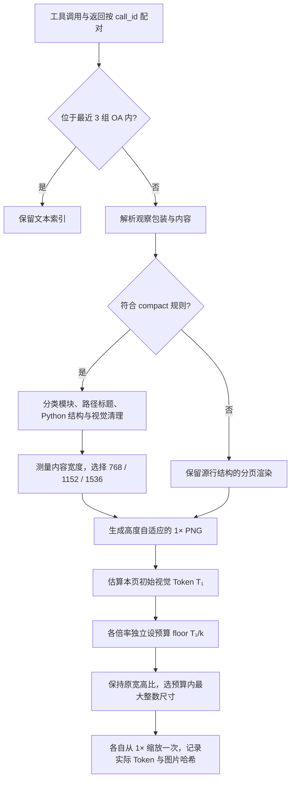
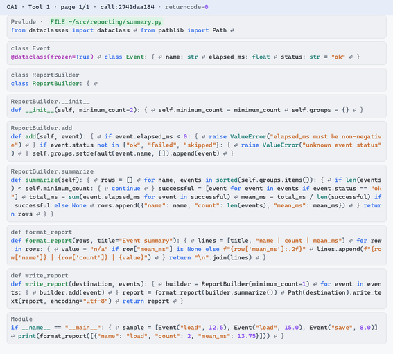

# SWE-Memory-Policy

把编码 Agent 的工具观察渲染为图片，并按**估算视觉 Token 比例**压缩。
`4×` 表示目标预算为该观察 **1× 图片的 1/4**；宽、高由预算共同确定。
本仓库只保留 Token 比例压缩，不再提供宽高分别除以倍率的接口。

默认将最近 **3 组 OA（工具调用批次及其返回）**保留为文本，更早的观察进入渲染。
这里只做离线转换，不调用模型、不执行工具，不需要 API 密钥。
不包含 overlap 删减、进入编辑阶段删除历史、状态卡或提示缓存策略。

## 安装与使用

需要 Python >= 3.11、Pillow 11.3.0、fonttools 4.59.0，以及本机字体。

```bash
python -m pip install -e ".[test]"
export IMAGE_MEMORY_FONT_PATHS="/path/to/CascadiaMono.ttf:/path/to/NotoSansCJK-Regular.ttc:/path/to/DejaVuSansMono.ttf"

# 同一条观察，生成 1–10× 图片。显式单条观察不应用 recent 窗口。
swe-memory-render examples/render_gallery.json --output-dir artifacts/gallery \
  --factors 1 2 3 4 5 6 7 8 9 10

# 完整轨迹：最近 3 组 OA 保留文本索引，渲染更早的观察。
swe-memory-render /path/to/task.traj.json --output-dir artifacts/history \
  --recent 3 --factors 1 2 3 4 5 6 7 8 9 10
```

也可运行 `python -m swe_memory_policy.offline`。输出目录必须不存在，避免覆盖已有结果。
倍率支持精确分数，例如 `--factors 1 2.5 4`；`--recent 0` 选择全部已完成 OA。
默认且当前唯一支持的估算配置为 `--model gpt-5.6-luna --detail high`。

## 从观察到图片



**1× 不是预先指定一个 Token 数再反推宽度。** 先排版，再根据排版后的图片估算 Token：

1. 测量标题、状态、正文和分区标题的自然行宽，计入内边距。
2. 从 **768、1152、1536 px** 中选择能容纳的最小档；Python、路径记录、diff、错误、traceback、pytest 最低为 **1152 px**，其他类型最低为 768 px。
3. 超过最高宽度的长行软换行，高度随内容增长。直接在所选宽度上渲染，字号为 **18 px**。
4. 得到 1× PNG 后计算其视觉 Token。1× 输出直接复制基础图片，像素、尺寸和 PNG 字节保持不变。

### 图片里有哪些模块

| 观察内容 | 图片中的模块标题或组织方式 |
|---|---|
| Python 代码 | `Prelude` / `Module`、`class …`、类方法、`def …`；不能完整解析时为 `Python fragment` |
| grep / rg 路径记录 | 同一文件的连续记录共用 `FILE ~/…` 标题，正文显示行号、列号和匹配内容；Python 注释按视觉策略去除 |
| 已截断观察 | `Truncated output`、`Output head`、`Output tail`，保留已有省略说明 |
| 差异、异常、测试 | diff、traceback、pytest 对应模块 |
| 其他文本 | JSON、文件目录列表、日志、`Shell output`、`Structured text`、空输出或错误模块 |
| 需要保留行列的表格 / 矩阵，或无法识别的包装 | 按源行布局渲染；长内容分页 |

这里的 Shell、Python、JSON 是**内容模块**。`tool_name="bash"` 不会把 Bash 返回的 Python 源码一律画成 Shell 模块。

### `{}`、路径与边界处理

- **Python `{}`**：用有颜色区分的生成标记表示已确认的 Python 缩进块，例如 `if ready: { return value }`。这些是图片的结构标记，图片中的表达不是可执行 Python。字典、集合、f-string 原有的花括号保持为原始代码符号。
- **路径压缩**：`project_root=/testbed` 对应 `~/`；读取 `/testbed/src/example.py` 时，文件标题显示 `FILE ~/src/example.py`。grep / rg 的重复文件路径提到分区标题，行号和内容对应关系仍保留，Python 注释按视觉策略去除。只替代确认的文件位置，不全局替换字符串里的路径。
- **视觉清理**：终端控制字符被处理；Python 词法注释和 AST 确认的 docstring 可被去除，普通三引号字符串保留；硬换行显示 `⏎`，软换行不增加原文换行符。源观察本身不被改写。
- **回退**：不认识的观察包装按源行渲染；不满足严格路径记录条件时继续普通分类；Python 无法完整解析时使用片段方式，词法解析失败时不生成 `{}`。不猜测截断内容或缺失工具返回。

compact 是用于阅读的视觉压缩，**不是逐字无损编码**。完整条件、宽度规则和回退表见 [渲染说明](docs/RENDERING.md)。

## Token 预算如何计算

本项目冻结估算器 `luna_patch32_high_20260906_v2`：先按最长边 2048 px 和最多 2500 个 32×32 patch 的规则预处理尺寸，再计算

$$
T(W,H)=\left\lceil\frac65\left\lceil\frac{W'}{32}\right\rceil\left\lceil\frac{H'}{32}\right\rceil\right\rceil,
\qquad B_k=\left\lfloor\frac{T_1}{k}\right\rfloor.
$$

在保持原宽高比的整数尺寸序列中，选满足预算的最大长边；短边向下取整、至少 1 px。
每档都从原始 1× 图片独立进行一次 Lanczos 缩放，不逐档累积缩放。
**输出估算 Token 必须不超过预算**；离散 patch 取整会使实际压缩倍率略大于标称倍率。
该 profile 已于 **2026-09-13** 对照 [OpenAI 图像 Token 文档](https://developers.openai.com/api/docs/guides/images-vision#patch-based-image-tokenization)核验。
这是一套版本固定的实验成本估算，不是代理供应商的实测计费，也不包含 QA 或其他请求文本。

估算器的最低图片成本为 2 Token。如果某档预算低于这个下限，记录
`status="unattainable_budget"`、`path=null`，保留基础图片和其他可行档位。
顶层 manifest 标记为 `partial`，CLI 写完结果后以退出码 **2** 结束；全部完成时为 `complete`、退出码 **0**。
不会输出超预算图片并标注为已达到目标。

## 同一观察的 1–10× 实际渲染

输入为仓库内人工构造的 [Python 工具观察](examples/render_gallery.json)，不含真实实验轨迹。
它展示文件路径简写、类 / 函数分区、生成的 `{}` 与语法配色。
下方均由本仓库 renderer 生成，点击图片可查看原图；GitHub 缩略图会统一显示宽度，实际尺寸见数字表。

<!-- GALLERY_START -->
| 1× | 2× | 3× | 4× | 5× |
|---|---|---|---|---|
| [](docs/images/gallery/image1x.png) | [](docs/images/gallery/image2x.png) | [](docs/images/gallery/image3x.png) | [](docs/images/gallery/image4x.png) | [](docs/images/gallery/image5x.png) |

| 6× | 7× | 8× | 9× | 10× |
|---|---|---|---|---|
| [](docs/images/gallery/image6x.png) | [](docs/images/gallery/image7x.png) | [](docs/images/gallery/image8x.png) | [](docs/images/gallery/image9x.png) | [](docs/images/gallery/image10x.png) |

| 档位 | 实际尺寸（px） | Token 预算 | 估算视觉 Token | 实际估算压缩倍率 |
|---|---:|---:|---:|---:|
| 1× | 1152 × 1041 | 1426 | 1426 | 1.0000× |
| 2× | 800 × 722 | 713 | 690 | 2.0667× |
| 3× | 640 × 578 | 475 | 456 | 3.1272× |
| 4× | 567 × 512 | 356 | 346 | 4.1214× |
| 5× | 496 × 448 | 285 | 269 | 5.3011× |
| 6× | 461 × 416 | 237 | 234 | 6.0940× |
| 7× | 426 × 384 | 203 | 202 | 7.0594× |
| 8× | 390 × 352 | 178 | 172 | 8.2907× |
| 9× | 355 × 320 | 158 | 144 | 9.9028× |
| 10× | 352 × 318 | 142 | 132 | 10.8030× |
<!-- GALLERY_END -->

生成方式：

```bash
python scripts/build_render_gallery.py --output-dir artifacts/readme-gallery
```

[图库 manifest](docs/images/gallery/manifest.json) 记录输入与源文件哈希、字体名称 / 哈希、各档尺寸及预算。
仓库不打包字体文件；复现相同 PNG 需要相同字体顺序、字体字节和依赖版本。

## 输入、输出与 Python 接口

支持 UTF-8 `.txt`、[单条观察 JSON](examples/observation.json)、Responses `input`、
包含 `transformed_request.input` 的快照，以及 mini-SWE-agent `messages` 轨迹。
完整轨迹按 `call_id` 配对，recent 的单位是 **OA 工具批次**，并行批次整体保留或整体渲染。
重复 ID、缺失返回或非文本返回会报错；仅 mini-SWE `messages` 轨迹末尾没有返回的调用会记录为 `ignored_terminal_call_ids` 并跳过。
原生 Responses `input` 中缺失返回仍报错。

```python
import json
from fractions import Fraction
from pathlib import Path
from swe_memory_policy.offline import render_history

value = json.loads(Path("examples/render_gallery.json").read_text())
manifest = render_history(
    value,
    Path("artifacts/python"),
    factors=(Fraction(1), Fraction(2), Fraction(4)),
    model="gpt-5.6-luna",
    detail="high",
)
```

```text
output/
  base/OA0001_Tool001_p001.png
  token_1p1/OA0001_Tool001_p001.png
  token_2p1/OA0001_Tool001_p001.png
  token_4p1/OA0001_Tool001_p001.png
  manifest.json
```

`2p1` 表示 2/1，`5p2` 表示 5/2。manifest 记录窗口选择、内容分类、原观察哈希、
生成结构统计、路径映射、源尺寸、目标预算、估算 Token、实际比例和 PNG 哈希。
最近文本窗口只记录索引，离线入口不会导出新的模型请求。

## 验证与来源

```bash
python -m pytest
ruff check src tests scripts
```

[渲染细节](docs/RENDERING.md) · [来源](PROVENANCE.md) · [更新说明](docs/SYNC_REPORT.md) · [源文件指纹](docs/LOCAL_SOURCE_MANIFEST.json)

仓库包含代码、测试、人工观察及其公开展示图片，不包含模型凭据、API 代理、任务调度器、真实任务轨迹或字体二进制。
